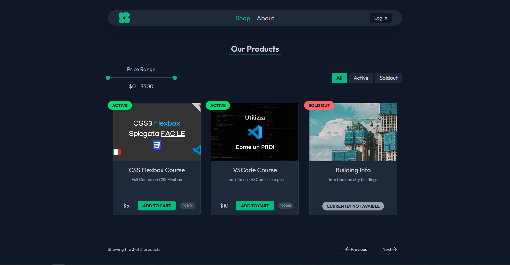

# Shoppy

Shoppy is a modern e-commerce where you can order digital and physical products, filter them by price and status, track your orders. Fully responsive and made with Next.js, TailwindCSS and TypeScript.




## Tech Stack

- React 19.2
- Next.js 16.0.1
- TailwindCSS 4.1
- TypeScript
- Supabase
- date-fns
- lucide-react
- react-hot-toast
- react-range

## Installation

1. Clone the repository:

```bash
git clone https://github.com/crstelli/shoppy-website
```

2. Go into project folder

```bash
cd shoppy
```

3. Install dependencies

```bash
npm install
```

4. Start the development server:

```bash
npm run dev
```

5. Open your browser and navigate to:

```bash
http://localhost:3000
```

## Enviroment Variables

You need to configure enviroment variables to make the app work correctly

```bash
SUPABASE_URL = Your Supabase Database URL
SUPABASE_KEY = Your Supabase Key

AUTH_SECRET = Next Auth Key

AUTH_GOOGLE_ID = Google Auth ID
AUTH_GOOGLE_SECRET = Google Auth Key
```

## Features

- Shop products browsing
- Filter by price range and current status
- Add items to cart and adjust quantity
- Full responsive design
- Google Login
- Track your orders
- Change your default delivery address

## Future Improvements

- Real payments integration
- Delivery address auto-suggestion
- Wishlist
- Tracking notifications

## Author

Giuseppe - [Linkedin]() - [Portfolio]()
